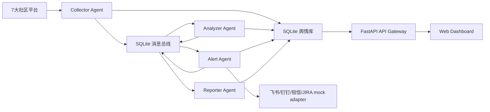

# V2 架构文档

## 架构图

## 四 Agent 职责

- Collector Agent：平台状态、增量同步位点、数据质量、API/浏览器降级策略。
- Analyzer Agent：LLM Prompt 模板、7类情绪、意图识别、实体抽取、相关性判断。
- Alert Agent：语义聚类、3σ异常检测、分级预警、自动工单。
- Reporter Agent：日报、周报、月报、版本复盘、双语摘要。

## 数据表

- `posts`：V1 标准舆情数据，新增 `game_id`。
- `agent_states`：Agent 当前状态、成功率、延迟、错误。
- `agent_messages`：Agent 间消息总线。
- `agent_runs`：每次 Agent 执行记录。
- `collector_offsets`：平台增量同步位点。
- `analysis_insights`：情绪、意图、实体、相关性、双语摘要。
- `issue_clusters`：语义聚类结果。
- `alerts`：风险预警。
- `work_orders`：自动工单。
- `agent_reports`：V2 报告产物。
- `audit_logs`：访问与操作审计。

## 渐进式开关

所有 V2 能力在 `app/config.py` 中通过 `FEATURE_FLAGS`、`AGENT_CONFIG`、`NLP_CONFIG` 配置。关闭 V2 不影响 V1 API 和看板。
